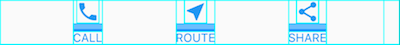

# 2주차 스터디

---

# Building Layouts

참고 : [https://docs.flutter.dev/development/ui/layout](https://docs.flutter.dev/development/ui/layout)

## Layout in Flutter

flutter 레이아웃 메커니즘의 핵심은 **위젯**

- 이미지, 아이콘, 글자 모두 위젯
- rows, columns, grids 등은 보이지 않는 위젯

이러한 위젯들을 구성하여 레이아웃 생성



- **container** : 자식 위젯들을 커스터마이징 할 수 있는 위젯 클래스
                  여백, 간격, 테두리, 배경색 등을 추가할 때 사용 → Compose의 modifier
- 여백이 있는 부분의 상위에 container 배치


---

### Layout a widget

1. 레이아웃 위젯 선택
    
    
2. 보이는 위젯 만들기
    
    ```dart
    Text('Hello World'),
    Image.asset(
      'images/lake.jpg',
      fit: BoxFit.cover,
    ),
    Icon(
      Icons.star,
      color: Colors.red[500],
    ),
    
    ```
    
3. 레이아웃 위젯에 보이는 위젯 추가
    
    ```dart
    const Center(
      child: Text('Hello World'),
    ),
    ```
    
    - 한 개의 위젯만 있을 때는 **child**
    ex) Center, Container…
    - 위젯의 연속일 때는 **children**
    ex) Row, Column, ListView, Stack…

1. 페이지에 레아이웃 위젯 추가
    
    **Material apps**
    
    `build()` : 위젯을 인스턴스화하고 반환하면 위젯 표시
    
    ```dart
    class MyApp extends StatelessWidget {
      const MyApp({super.key});
    
      @override
      Widget **build**(BuildContext context) {
        **return** MaterialApp(
          title: 'Flutter layout demo',
          home: **Scaffold**(
            appBar: AppBar(
              title: const Text('Flutter layout demo'),
            ),
            body: const Center(
              child: Text('Hello World'),
            ),
          ),
        );
      }
    }
    ```
    
    - Scaffold 위젯 사용
        - 기본 배너(appBar), 배경색(background color) 제공
        - drawers, bottom sheet를 추가하기 위한 API 제공
    
    **Non-Material apps**
    
    앱의 `build()` 메소드에 Center 위젯 추가 가능
    
    ```dart
    class MyApp extends StatelessWidget {
      const MyApp({super.key});
    
      @override
      Widget **build**(BuildContext context) {
        **return Container**(
          decoration: const BoxDecoration(color: Colors.white),
          child: const Center(
            child: Text(
              'Hello World',
              textDirection: TextDirection.ltr,
              style: TextStyle(
                fontSize: 32,
                color: Colors.black87,
              ),
            ),
          ),
        );
      }
    }
    ```
    
    - non-material app에서는 appBar, title, background color 포함 x 사용하려면 직접 빌드

---

### 여러 위젯을 세로 및 가로로 배치

`row` 위젯을 사용하여 가로로 정렬, `column` 위젯을 사용하여 세로로 정렬

하위 위젯에 `row` , `column` 이 올 수 있음


 

**위젯 정렬**

`mainAxisAlignment` 및 `crossAxisAlignment` 속성을 사용하여 행 또는 열이 자식을 정렬하는 방법을 제어

- Row의 경우 main은 가로로 실행, cross는 세로로 실행
- Column의 경우 main은 세로로 실행, cross는 가로로 실행


```dart
**Row**(
  **mainAxisAlignment: MainAxisAlignment.spaceEvenly,**
  children: [
    Image.asset('images/pic1.jpg'),
    Image.asset('images/pic2.jpg'),
    Image.asset('images/pic3.jpg'),
  ],
);
```

- `spaceEvenly` : row의 main 정렬(가로), 이미지 사이 전후에 여유 **수평** 공간을 균등하게 나눔

```dart
**Column**(
  **mainAxisAlignment: MainAxisAlignment.spaceEvenly,**
  children: [
    Image.asset('images/pic1.jpg'),
    Image.asset('images/pic2.jpg'),
    Image.asset('images/pic3.jpg'),
  ],
);
```

- `spaceEvenly` : column의 main 정렬(세로), 이미지 사이 전후에 여유 **수직** 공간을 균등하게 나눔

**위젯 크기 조정**

레이아웃이 너무 커서 장치에 맞지 않으면 영향을 받는 가장자리를 따라 줄무늬 패턴이 나타남

→ 확장 위젯을 사용하여 행 또는 열에 맞게 위젯 크기 조절 가능.

```dart
Row(
  crossAxisAlignment: CrossAxisAlignment.center,
  children: [
    **Expanded**(
      child: Image.asset('images/pic1.jpg'),
    ),
    **Expanded**(
			**flex: 2**,
      child: Image.asset('images/pic2.jpg'),
    ),
    **Expanded**(
      child: Image.asset('images/pic3.jpg'),
    ),
  ],
);
```

- 위젯의 `flex` 속성을 사용하여 공간 범위 설정 → Compose의 가중치

**위젯 패킹**

기본적으로 row 또는 column은 가능한 한 많은 공간을 차지하지만, 서로 가깝게 패킹하려면 `mainAxisSize` 를 `mainAxisSize.min` 으로 설정

```dart
Row(
  **mainAxisSize: MainAxisSize.min**,
  children: [
    Icon(Icons.star, color: Colors.green[500]),
    Icon(Icons.star, color: Colors.green[500]),
    Icon(Icons.star, color: Colors.green[500]),
    const Icon(Icons.star, color: Colors.black),
    const Icon(Icons.star, color: Colors.black),
  ],
)
```

**행과 열의 중첩**


```dart
//별 5개 행
var stars = Row(
  mainAxisSize: MainAxisSize.min,
  children: [
    Icon(Icons.star, color: Colors.green[500]),
    Icon(Icons.star, color: Colors.green[500]),
    Icon(Icons.star, color: Colors.green[500]),
    const Icon(Icons.star, color: Colors.black),
    const Icon(Icons.star, color: Colors.black),
  ],
);

//별 + 리뷰 수
final ratings = Container(
  padding: const EdgeInsets.all(20),
  child: **Row**(
    mainAxisAlignment: MainAxisAlignment.spaceEvenly,
    children: [
      **stars**,
      const Text(
        '170 Reviews',
        style: TextStyle(
          color: Colors.black,
          fontWeight: FontWeight.w800,
          fontFamily: 'Roboto',
          letterSpacing: 0.5,
          fontSize: 20,
        ),
      ),
    ],
  ),
);
```


```dart
//텍스트 고정 스타일
const descTextStyle = TextStyle(
  color: Colors.black,
  fontWeight: FontWeight.w800,
  fontFamily: 'Roboto',
  letterSpacing: 0.5,
  fontSize: 18,
  height: 2,
);

// DefaultTextStyle.merge()은 텍스트에 디폴트로 적용되는 값 설정
// 스타일은 상위에 한번 적용하면 하위에 계승
final iconList = **DefaultTextStyle.merge**(
  **style: descTextStyle**,
  child: Container(
    padding: const EdgeInsets.all(20),
    child: Row(
      **mainAxisAlignment: MainAxisAlignment.spaceEvenly**,
      children: [
        Column(
          children: [
            Icon(Icons.kitchen, color: Colors.green[500]),
            const Text('PREP:'),
            const Text('25 min'),
          ],
        ),
        Column(
          children: [
            Icon(Icons.timer, color: Colors.green[500]),
            const Text('COOK:'),
            const Text('1 hr'),
          ],
        ),
        Column(
          children: [
            Icon(Icons.restaurant, color: Colors.green[500]),
            const Text('FEEDS:'),
            const Text('4-6'),
          ],
        ),
      ],
    ),
  ),
);
```

```dart
//왼쪽 글자 리스트
final leftColumn = Container(
  padding: const EdgeInsets.fromLTRB(20, 30, 20, 20),
  child: Column(
    children: [
      **titleText,
      subTitle,
      ratings,
      iconList**,
    ],
  ),
);
```

- 너비 제한을 위하여 크기 상자에 배치

```dart
//전체 화면
body: Center(
  child: Container(
    margin: const EdgeInsets.fromLTRB(0, 40, 0, 30),
    height: 600,
    child: **Card**(
      child: **Row**(
        crossAxisAlignment: **CrossAxisAlignment.start**,
        children: [
          SizedBox(
            width: 440,
            child: **leftColumn**,
          ),
          **mainImage**,
        ],
      ),
    ),
  ),
),
```

- `CrossAxisAlignment.start` : row의 속성이므로 가로축 기준 위쪽 정렬
- 참고용 블로그 ([https://beomseok95.tistory.com/310](https://beomseok95.tistory.com/310))

---

### 일반적인 레이아웃 위젯

위젯은 **위젯 라이브러리의 표준 위젯**과 **Material 라이브러리의 특수 위젯** 두 가지

모든 앱은 위젯 라이브러리를 사용할 수 있지만 Material app만 Material Component 라이브러리 사용 가능

**표준 위젯**

- Container : 위젯에 padding, margins, borders, background color 추가
- GridView : 위젯을 스크롤 가능한 그리드로 배치
- ListView : 위젯을 스크롤 가능한 리스트로 배치
- Stack : 위젯을 다른 위젯 위에 겹쳐 놓음

**Material 위젯**

- Card : 관련 정보를 둥근 모서리와 drop shadow가 있는 box로 구성
- ListTile : 최대 3줄의 텍스트와 선택적 선행 및 후행 아이콘을 행으로 구성

**Container**

- 대부분의 레이아웃은 padding을 사용하여 위젯을 분리하거나 border 또는 margin을 추가하기 위해 container를 자유롭게 사용
- 전체 레이아웃을 container에 넣고 background color 또는 image를 변경하여 장치의 배경 변경 가능
- 단일 하위 위젯 포함, 그러나 해당 하위 위젯은 row, column, 위젯 트리의 루트일 수 있음

```dart
Widget _buildImageColumn() {
  return **Container**(
    decoration: const BoxDecoration(
      **color: Colors.black26**,
    ),
    child: Column(
      children: [
        _buildImageRow(1),
        _buildImageRow(3),
      ],
    ),
  );
}
```

```dart
Widget _buildDecoratedImage(int imageIndex) => Expanded(
      child: **Container**(
        decoration: BoxDecoration(
          **border: Border.all(width: 10, color: Colors.black38)**,
          **borderRadius: const BorderRadius.all(Radius.circular(8))**,
        ),
        **margin: const EdgeInsets.all(4)**,
        child: Image.asset('images/pic$imageIndex.jpg'),
      ),
    );

Widget _buildImageRow(int imageIndex) => Row(
      children: [
        _buildDecoratedImage(imageIndex),
        _buildDecoratedImage(imageIndex + 1),
      ],
    );
```

**GridView**

위젯을 2차원 목록으로 배치

사전 제작된 목록을 제공하거나 직접 사용자 지정 그리드 구축 가능

내용이 너무 길어서 렌더 상자에 맞지 않는 것을 감지하면 자동으로 스크롤 제공

```dart
Widget _buildGrid() => **GridView.extent**(
    maxCrossAxisExtent: 150,
    padding: const EdgeInsets.all(4),
    mainAxisSpacing: 4,
    crossAxisSpacing: 4,
    children: _buildGridTileList(30));

// The images are saved with names pic0.jpg, pic1.jpg...pic29.jpg.
// The List.generate() constructor allows an easy way to create
// a list when objects have a predictable naming pattern.
List<Container> _buildGridTileList(int count) => List.generate(
    count, (i) => Container(child: Image.asset('images/pic$i.jpg')));
```

- `GridView.extent` 를 사용하여 최대 150 픽셀 너비의 타일로 그리드 작성
- `GridView.count` 를 사용하여 세로 모드에서는 2개 타일, 가로 모드에서는 3개 타일의 그리드 생성

**ListView**

column과 비슷한 위젯

내용이 렌더 상자에 비해 너무 길 때 자동으로 스크롤 제공

```dart
Widget _buildList() {
  return **ListView**(
    children: [
      _tile('CineArts at the Empire', '85 W Portal Ave', Icons.theaters),
      _tile('The Castro Theater', '429 Castro St', Icons.theaters),
      _tile('Alamo Drafthouse Cinema', '2550 Mission St', Icons.theaters),
      _tile('Roxie Theater', '3117 16th St', Icons.theaters),
      _tile('United Artists Stonestown Twin', '501 Buckingham Way',
          Icons.theaters),
      _tile('AMC Metreon 16', '135 4th St #3000', Icons.theaters),
      const Divider(),
      _tile('K\'s Kitchen', '757 Monterey Blvd', Icons.restaurant),
      _tile('Emmy\'s Restaurant', '1923 Ocean Ave', Icons.restaurant),
      _tile(
          'Chaiya Thai Restaurant', '272 Claremont Blvd', Icons.restaurant),
      _tile('La Ciccia', '291 30th St', Icons.restaurant),
    ],
  );
}

//형태 및 속성 고정
ListTile _tile(String title, String subtitle, IconData icon) {
  return ListTile(
    title: Text(title,
        style: const TextStyle(
          fontWeight: FontWeight.w500,
          fontSize: 20,
        )),
    subtitle: Text(subtitle),
    leading: Icon(
      icon,
      color: Colors.blue[500],
    ),
  );
}
```

**Stack**

기본 위젯(보통 이미지) 위에 위젯 정렬

위젯들은 기본 위젯들과 완전히 또는 부분적으로 중첩 가능

스크롤 불가

```dart
Widget _buildStack() {
  return **Stack**(
    alignment: const Alignment(0.6, 0.6),
    children: [
      const **CircleAvatar**(
        backgroundImage: AssetImage('images/pic.jpg'),
        radius: 100,
      ),
      **Container**(
        decoration: const BoxDecoration(
          color: Colors.black45,
        ),
        child: const Text(
          'Mia B',
          style: TextStyle(
            fontSize: 20,
            fontWeight: FontWeight.bold,
            color: Colors.white,
          ),
        ),
      ),
    ],
  );
}
```

**Card**

관련 정보 덩어리를 포함, 종종 ListTile과 함께 사용

card에는 단일 하위 항목이 있지만, 하위 항목은 row, column, list, grid 또는 여러 하위 항목을 지원하는 기타 위젯일 수 있음

SizeBox를 사용하여 카드 크기 제한 가능

둥근 모서리와 drop shadow 사용 가능

```dart
Widget _buildCard() {
  return **SizedBox**(
    **height: 210,**
    child: **Card**(
      child: **Column**(
        children: [
          **ListTile**(
            title: const Text(
              '1625 Main Street',
              style: TextStyle(fontWeight: FontWeight.w500),
            ),
            subtitle: const Text('My City, CA 99984'),
            leading: Icon(
              Icons.restaurant_menu,
              color: Colors.blue[500],
            ),
          ),
          **const Divider()**,
          **ListTile**(
            title: const Text(
              '(408) 555-1212',
              style: TextStyle(fontWeight: FontWeight.w500),
            ),
            leading: Icon(
              Icons.contact_phone,
              color: Colors.blue[500],
            ),
          ),
          ListTile(
            title: const Text('costa@example.com'),
            leading: Icon(
              Icons.contact_mail,
              color: Colors.blue[500],
            ),
          ),
        ],
      ),
    ),
  );
}
```

- 3개의 ListTile을 포함하고 SizedBox로 포장하여 크기를 정한 카드
- Divider는 첫번째 ListTile과 두번째 ListTile을 구분

**ListTile**

Material 라이브러리의 특수 row 위젯

최대 3줄의 텍스트와 선택적 선행 및 후행 아이콘을 포함하는 행을 만들 수 있음

---

## Creating responsive and adaptive apps

반응형 앱은 화면이나 창의 크기와 모양에 따라 UI 배치

→ 동일한 앱이 워치, 휴대폰, 태블릿, 랩톱 또는 데스크톱 컴퓨터에 이르기까지 다양한 장치에서 실행될 수 있는 경우에 특히 필요

→ 사용자가 노트북이나 데스크톱에서 창 크기를 조정하거나 휴대폰, 태블릿의 방향을 변경하면 앱은 이에 따라 UI를 재정렬하여 응답해야함

**Creating a responsive Flutter app**

1. LayoutBuilder 클래스 사용
    
    Builder 속성에서 BoxConstraints 개체를 얻음
    
    Constraint의 속성을 검토하여 표시할 내용을 결정
    
    장치의 높이, 가로 세로 비율 또는 기타 속성을 기준으로 디스플레이 조정 가능
    
2. 빌드 기능에서 MediaQuery.of() 메소드 사용
    
    현재 앱의 크기, 방향 확인 가능
    
    특정 위젯의 크기뿐만 아니라 전체 컨텍스트를 기반으로 결정하려는 경우에 더 유용
    
    - 유용한 위젯 및 클래스
        - `[AspectRatio](https://api.flutter.dev/flutter/widgets/AspectRatio-class.html)`
        - `[CustomSingleChildLayout](https://api.flutter.dev/flutter/widgets/CustomSingleChildLayout-class.html)`
        - `[CustomMultiChildLayout](https://api.flutter.dev/flutter/widgets/CustomMultiChildLayout-class.html)`
        - `[FittedBox](https://api.flutter.dev/flutter/widgets/FittedBox-class.html)`
        - `[FractionallySizedBox](https://api.flutter.dev/flutter/widgets/FractionallySizedBox-class.html)`
        - `[LayoutBuilder](https://api.flutter.dev/flutter/widgets/LayoutBuilder-class.html)`
        - `[MediaQuery](https://api.flutter.dev/flutter/widgets/MediaQuery-class.html)`
        - `[MediaQueryData](https://api.flutter.dev/flutter/widgets/MediaQueryData-class.html)`
        - `[OrientationBuilder](https://api.flutter.dev/flutter/widgets/OrientationBuilder-class.html)`

---

## Building adaptive apps

### Building adaptive layouts

앱을 실행할 화면의 다양한 크기와 모양에 맞게 조정하는 방법을 가장 먼저 고려

**Layout widgets**

- Single child
    - `[Align](https://api.flutter.dev/flutter/widgets/Align-class.html)` : 자식을 그 자체 내에 정렬
    - `[AspectRatio](https://api.flutter.dev/flutter/widgets/AspectRatio-class.html)` : 특정 가로 세로 비율의 자식 크기 조정
    - `[ConstrainedBox](https://api.flutter.dev/flutter/widgets/ConstrainedBox-class.html)` : 자식에 크기 제약 조건을 적용하여 최소 또는 최대 크기를 제어
    - `[CustomSingleChildLayout](https://api.flutter.dev/flutter/widgets/CustomSingleChildLayout-class.html)` : 위임 기능을 이용하여 단일 하위 위젯 배치
    - `[Expanded](https://api.flutter.dev/flutter/widgets/Expanded-class.html)` and `[Flexible](https://api.flutter.dev/flutter/widgets/Flexible-class.html)` : row 또는 column의 자식이 사용 가능한 공간을 채울 수 있도록 축소 또는 확장
    - `[FractionallySizedBox](https://api.flutter.dev/flutter/widgets/FractionallySizedBox-class.html)` : 자식 크기를 사용 가능한 공간의 일부로 조정
    - `[LayoutBuilder](https://api.flutter.dev/flutter/widgets/LayoutBuilder-class.html)` : 부모 크기에 따라 자체 리플로우 할 수 있는 위젯을 만듦
    - `[SingleChildScrollView](https://api.flutter.dev/flutter/widgets/SingleChildScrollView-class.html)` : 단일 하위에 스크롤 추가
- Multichild
    - `[Column](https://api.flutter.dev/flutter/widgets/Column-class.html)`, `[Row](https://api.flutter.dev/flutter/widgets/Row-class.html)`, and `[Flex](https://api.flutter.dev/flutter/widgets/Flex-class.html)` : 단일 수평 / 수직 실행으로 하위 항목 배치
    - `[CustomMultiChildLayout](https://api.flutter.dev/flutter/widgets/CustomMultiChildLayout-class.html)` : 위임 기능을 이용하여 레이아웃 단계 중에 여러 자식 배치
    - `[Flow](https://api.flutter.dev/flutter/widgets/Flow-class.html)` : CustomMultiChildLayout 과 유사하지만 레아아웃 단계가가 아닌 paint 단계에서 수행하므로 더 효율적
    - `[ListView](https://api.flutter.dev/flutter/widgets/ListView-class.html)`, `[GridView](https://api.flutter.dev/flutter/widgets/GridView-class.html)`, and `[CustomScrollView](https://api.flutter.dev/flutter/widgets/CustomScrollView-class.html)` : 스크롤 가능한 하위 목록을 제공
    - `[Stack](https://api.flutter.dev/flutter/widgets/Stack-class.html)` : stack의 가장자리를 기준으로 여러 자식을 배치
    - `[Table](https://api.flutter.dev/flutter/widgets/Table-class.html)` : 자식에 대해 여러 row와 column을 결합하는 고전적인 테이블 레이아웃 알고리즘 사용
    - `[Wrap](https://api.flutter.dev/flutter/widgets/Wrap-class.html)` : 여러 수평 / 수직 수행에 해당 하위 항목 표시
    

**Visual density**

VisualDensity 클래스를 사용하면 터치 장치에서 버튼을 더 크게 만들어 전체 응용 프로그램에서 뷰의 밀도를 쉽게 조절할 수 있음

MaterialApp에서 VisualDensity를 변경하면 이를 지원하는 Material Components가 일치하도록 밀도를 애니메이션화

기본적으로 수평 및 수직 밀도는 모두 0.0으로 설정되지만 원하는 음수 및 양수 값으로 밀도를 설정 가능

```dart
double densityAmt = **touchMode ? 0.0 : -1.0**;
//내 뷰에서 사용하려면 VisualDensity density = **Theme.of(context).visualDensity**;
**VisualDensity** density =
    **VisualDensity(horizontal: densityAmt, vertical: densityAmt)**;
return **MaterialApp**(
  theme: ThemeData(**visualDensity: density**),
  home: MainAppScaffold(),
  debugShowCheckedModeBanner: false,
);
```

Container는 density의 변화에 자동으로 반응할 뿐만 아니라 변화할 때 애니메이션 생성

→ 내장된 구성요소와 함게 사용자 지정 구성요소를 연결하여 앱 전체에 원활한 전환 효과를 얻을 수 있음

단위가 없기 때문에 적용하는 숫자에 따라서 보기마다 다른 의미를 가질 수 있음.

**Contextual layout**

density 변경이 필요한데 필요한 작업을 수행하는 위젯을 찾을 수 없는 경우 보다 절차적인 방법으로 매개변수를 조정하거나, 크기를 계산하거나, 위젯을 스왑하거나, 특정 폼 팩터에 맞게 UI를 완전히 재구성 가능

- 화면 기반 breakpoint
    
    절차 레이아웃의 가장 간단한 형태
    
    MediaQuery API를 사용하여 작업 수행
    
    ```dart
    class FormFactor {
      static double desktop = 900;
      static double tablet = 600;
      static double handset = 300;
    }
    
    ScreenType getFormFactor(BuildContext context) {
      // Use .shortestSide to detect device type regardless of orientation
      double deviceWidth = **MediaQuery.of**(context).size.shortestSide;
      if (deviceWidth > FormFactor.desktop) return **ScreenType.Desktop**;
      if (deviceWidth > FormFactor.tablet) return **ScreenType.Tablet**;
      if (deviceWidth > FormFactor.handset) return **ScreenType.Handset**;
      return **ScreenType.Watch**;
    }
    ```
    
    - breakpoint 사용하여 장치 유형 확인 가능
    
    ```dart
    **enum ScreenSize { Small, Normal, Large, ExtraLarge }**
    
    ScreenSize getSize(BuildContext context) {
      double deviceWidth = **MediaQuery.of**(context).size.shortestSide;
      if (deviceWidth > 900) return **ScreenSize.ExtraLarge**;
      if (deviceWidth > 600) return **ScreenSize.Large**;
      if (deviceWidth > 300) return **ScreenSize.Normal**;
      return **ScreenSize.Small**;
    }
    ```
    
    - 더 추상화하여 소규모에서 대규모로 정의 가능
    
    화면 기반 breakpoint를 사용하여 최상위 위젯 트리를 다시 이동할 수 있음
    
    ex 사용자가 핸드셋에 없을 때 수직 레이아웃에서 수평 레이아웃으로 전환
    
    ```dart
    **bool isHandset = MediaQuery.of(context).size.width < 600;**
    return Flex(
        children: [Text('Foo'), Text('Bar'), Text('Baz')],
        direction: isHandset ? Axis.vertical : Axis.horizontal);
    
    Widget foo = Row(
      children: [
        **...isHandset ? _getHandsetChildren() : _getNormalChildren()**,
      ],
    );
    ```
    

- Use **LayoutBuilder** for extra flexibility
    
    전체 화면 크기를 확인하는 것이 전체 화면 페이지 또는 전체 레이아웃 결정에 유용하지만 중첩된 하위 보기에는 적합하지 않은 경우 존재
    
    이럴 때 `LayoutBuilder` 클래스 사용, 위젯에 들어오는 local size constraints에 응답할 수 있으므로 전역 값에 의존하는 것보다 위젯을 더 유용하게 사용 가능
    
    ```dart
    Widget foo = **LayoutBuilder**(
        builder: (context, constraints) {
      **bool useVerticalLayout = constraints.maxWidth < 400.0;**
      return Flex(
        children: [
          Text('Hello'),
          Text('World'),
        ],
        **direction: useVerticalLayout ? Axis.vertical : Axis.horizontal,**
      );
    });
    ```
    
- Device segmentation
    
    규모에 관계없이 **실제 실행 중인 플랫폼을 기준**으로 레이아웃을 결정하고 싶을 때 사용
    
    ex) 커스텀 title bar 작성 시 레이아웃을 조정하여 기본 window 버튼에 포함되지 않도록 해야함
    
    ```dart
    bool get isMobileDevice => !kIsWeb && (Platform.isIOS || Platform.isAndroid);
    bool get isDesktopDevice =>
        !kIsWeb && (Platform.isMacOS || Platform.isWindows || Platform.isLinux);
    bool get isMobileDeviceOrWeb => kIsWeb || isMobileDevice;
    bool get isDesktopDeviceOrWeb => kIsWeb || isDesktopDevice;
    ```
    
    - 현재 사용 중인 플랫폼의 조합을 결정하기 위해 kIsWeb 값과 함께 Platfrom API 사용 가능
    - [dart.io](http://dart.io) 패키지가 웹 대상에서 지원되지 않기 때문에 예외를 발생시키지 않고는 웹 빌드에서 Platform API에 액세스 할 수 없음

**Single source of truth for styling**

padding, spacing, corner shape, font size 등과 같은 스타일 값에 대한 단일 출처를 작성하면 보기를 유지하는 것이 더 쉬워짐

```dart
class Insets {
  static const double xsmall = 3;
  static const double small = 4;
  static const double medium = 5;
  static const double large = 10;
  static const double extraLarge = 20;
  // etc
}

class Fonts {
  static const String raleway = 'Raleway';
  // etc
}

class TextStyles {
  static const TextStyle raleway = const TextStyle(
    fontFamily: Fonts.raleway,
  );
  static TextStyle buttonText1 =
      TextStyle(fontWeight: FontWeight.bold, fontSize: 14);
  static TextStyle buttonText2 =
      TextStyle(fontWeight: FontWeight.normal, fontSize: 11);
  static TextStyle h1 = TextStyle(fontWeight: FontWeight.bold, fontSize: 22);
  static TextStyle h2 = TextStyle(fontWeight: FontWeight.bold, fontSize: 16);
  static late TextStyle body1 = raleway.copyWith(color: Color(0xFF42A5F5));
  // etc
}
```

- 모든 뷰가 동일한 공유 설계 시스템 규칙을 참조하기 때문에 더 낫고 일관성 있게 보이는 경향이 있음
- 오류가 발생하기 쉬운 검색 및 교체 대신에 특정 플랫폼의 값을 변경하거나 조정
- 공유 규칙을 사용하면 설계 측면에서 일관성을 강화하는 데 도움이 되는 추가적인 이점이 있다.

---

## Constraint

([https://docs.flutter.dev/development/ui/layout/constraints](https://docs.flutter.dev/development/ui/layout/constraints))

---

## Dealing with box constraints

플러터에서 위젯은 기본 RenderBox 객체에 의해 렌더링

렌더링 박스는 부모에 의해 constraint가 주어지며 해당 조건 내에서 크기가 제어됨

constraint는 최소 너비와 최대 너비, 높이로 구성되며, 크기는 특정 너비와 높이로 구성

constraint 제어 방법

- 가능한 최대 크기로 하고 싶을 때 ex) Center, ListView에서 사용하는 Box
- 자식 요소들과 같은 크기로 만들려고 할 때 ex) Transform, Opacity에서 사용하는 Box
- 개별적인 크기를 갖게 할 때 ex) Image, Text에서 사용하는 Box

때때로 엄격한 constraint (최소 너비와 최대 너비가 같을 때)는 렌더링 박스가 크기를 결정할 수 있는 여지를 남기지 않는데, 대표적인 예가 RenderView 클래스가 포함된 App 위젯

어플리케이션의 build() 메소드에 의해 반환되는 자식에서 사용하는 box에는 컨텐츠 영역을 전부 채워야 하는 constraint가 주어짐. box는 자식에게 constraint를 전달 → 어플리케이션 렌더 트리의 루트에 여러 box를 배치하면 엄격한 constraint들에 의해 서로 정확히 들어맞을 것

일부 박스들은 constraint를 느슨하게 하는데 이는 최대치는 유지되지만 최소치는 제거된다는 것을 의미 ex) Center

**Unbounded constraints**

특정한 상황에서 박스에 주어지는 constraint는 제한이 없거나 무한함 = 최대 너비 혹은 최대 높이가 `double.INFINITY` 로 설정

제한이 없는 contraint를 가지는 렌더링 박스를 보게 되는 일반적인 경우는 FlexBox(Row, Column)와 스크롤 가능 영역(ListView, ScrollView 하위 클래스) 내부

**Flex**

FlexBox는 **제한된 constraint가 있**는지, **지정된 방향으로 제한되지 않는지**에 따라 다르게 동작

- 제한된 constraint → 지정된 방향으로 가능한 만큼 커지게
- 제한되지 않은 constraint → 해당 방향으로 자식 요소들을 딱 맞추려 함. 이 경우 자식 요소에 `flex` 를 0 이외의 다른 것으로 설정할 수 없음.
    
    = 위젯 라이브러리에서 FlexBox가 또 다른 FlexBox나 ScrollBox 안에 있을 때 Expanded를 사용할 수 없다
    

---

# Adding interactivity

## Stateful and stateless widgets

위젯은 stateful하거나 stateless

**stateful** → 변경될 수 있는 경우 (ex. 사용자가 위젯과 상호작용 할 때)

**stateless** → 절대 변하지 않음 (ex. 아이콘, 아이콘 버튼, 텍스트) = `StatelessWidget`

stateful 위젯은 **동적**

- 사용자 상호 작용에 의해 트리거되거나 데이터를 수신할 때 이벤트에 따라 모양을 변경
- Checkbox, Radiobutton, Slider, InkWell, From, TextField
- 상태는 상태 개체에 저장되어 위젯의 상태와 모양을 구분
- 위젯의 상태가 변경되면 상태 개체가 `setState()` 를 호출하여 프레임워크에 위젯을 다시 그리도록 지시

### Creating a stateful widget

사용자 정의 상태 저장 위젯 구현 시 필요한 클래스

1. 위젯을 정의하는 `StatefulWidget`의 하위 클래스
2. 해당 위젯에 대한 상태를 포함하고 위젯의 `build()` 메소드를 정의하하는 `State`의 하위 클래스

⇒ 코드랩 작성

(확실히 문서 그냥 보는 것보다는 한번 코드를 따라 쳐보고 분석하니까 이해가 잘 되네요… 👍)

---

## Managing state

stateful widget의 state는 누가 관리하는가?

어떤 접근 방식을 사용할 지 어떻게 결정하는가?

- state가 checkbox의 선택, slider의 위치와 같은 사용자 데이터인 경우 = 상위 위젯
- state가 애니메이션과 같이 문제의 상태가 운동성인 경우 = 위젯 자체
- 의심스러울 때는 상위 위젯에서 state 관리 시작

**The widget maganes its own state**

: 위젯이 내부적으로 상태 관리

ex) ListView는 내용이 렌더 상자를 초과하면 자동으로 스크롤 되는데, 대부분의 개발자는 ListView의 스크롤 동작을 관리하지 않음 = ListView 위젯 자체가 스크롤 offset을 관리

```dart
import 'package:flutter/material.dart';

// TapboxA manages its own state.

//------------------------- TapboxA ----------------------------------

//TapboxA의 상태 관리
class TapboxA extends StatefulWidget {
  const TapboxA({super.key});

  @override
  State<TapboxA> createState() => _TapboxAState();
}

//상자의 현재 색상을 결정하는 부울 정의
class _TapboxAState extends State<TapboxA> {
  bool _active = false;

	//상자를 탭하면 부울을 업데이트하고 setState() 함수를 호출하여 UI 업데이트하는 _handleTap() 함수 정의
  void _handleTap() {
    setState(() {
      _active = !_active;
    });
  }

  @override
  Widget build(BuildContext context) {
    return GestureDetector(
			//위젯에 대한 모든 대화형 동작 구현
      onTap: _handleTap,
      child: Container(
        width: 200.0,
        height: 200.0,
        decoration: BoxDecoration(
          color: _active ? Colors.lightGreen[700] : Colors.grey[600],
        ),
        child: Center(
          child: Text(
            _active ? 'Active' : 'Inactive',
            style: const TextStyle(fontSize: 32.0, color: Colors.white),
          ),
        ),
      ),
    );
  }
}

//------------------------- MyApp ----------------------------------

class MyApp extends StatelessWidget {
  const MyApp({super.key});

  @override
  Widget build(BuildContext context) {
    return MaterialApp(
      title: 'Flutter Demo',
      home: Scaffold(
        appBar: AppBar(
          title: const Text('Flutter Demo'),
        ),
        body: const Center(
          child: TapboxA(),
        ),
      ),
    );
  }
}
```

**The parent manages the widget’s state**

: 대부분의 경우 상위 위젯은 state를 관리하고 하위 위젯에 업데이트 시기를 알려주는 것이 가장 적합함

ex) IconButton 사용 시 아이콘을 탭 가능한 button으로 처리 가능. IconButton은 stateless 위젯. 부모 위젯이 버튼을 눌렀는지 알아야 적절한 조치를 취할 수 있음

```dart
import 'package:flutter/material.dart';

// ParentWidget manages the state for TapboxB.

//------------------------ ParentWidget --------------------------------

class ParentWidget extends StatefulWidget {
  const ParentWidget({super.key});

  @override
  State<ParentWidget> createState() => _ParentWidgetState();
}

class _ParentWidgetState extends State<ParentWidget> {
  bool _active = false;

	//상자를 누르면 호출되는 메소드 구현
  void _handleTapboxChanged(bool newValue) {
    setState(() {
      _active = newValue;
    });
  }

  @override
  Widget build(BuildContext context) {
    return SizedBox(
      child: TapboxB(
				//부모에서 관리 중
        **active: _active,
        onChanged: _handleTapboxChanged,**
      ),
    );
  }
}

//------------------------- TapboxB ----------------------------------

//모든 state가 상위에서 처리되기 때문에 StatelessWidget
//this로 상위에서 받아오고 있음
class TapboxB extends StatelessWidget {
  const TapboxB({
    super.key,
    this.active = false,
    required this.onChanged,
  });

  final bool active;
  final ValueChanged<bool> onChanged;

	//Tap이 감지되면 부모에게 알려줌
  void _handleTap() {
    onChanged(!active);
  }

  @override
  Widget build(BuildContext context) {
    return GestureDetector(
      onTap: _handleTap,
      child: Container(
        width: 200.0,
        height: 200.0,
        decoration: BoxDecoration(
          color: active ? Colors.lightGreen[700] : Colors.grey[600],
        ),
        child: Center(
          child: Text(
            active ? 'Active' : 'Inactive',
            style: const TextStyle(fontSize: 32.0, color: Colors.white),
          ),
        ),
      ),
    );
  }
}
```

**A mix-and-match approach**

: stateful widget은 state의 일부를 관리하고 상위 위젯은 state의 다른 측면을 관리

```dart
import 'package:flutter/material.dart';

//---------------------------- ParentWidget ----------------------------

class ParentWidget extends StatefulWidget {
  const ParentWidget({super.key});

  @override
  State<ParentWidget> createState() => _ParentWidgetState();
}

//state 관리 부울
class _ParentWidgetState extends State<ParentWidget> {
  bool _active = false;

	//상자를 누르면 호출
	//_active state가 변경되면 setState()를 호출하여 UI 업데이트
  void _handleTapboxChanged(bool newValue) {
    setState(() {
      _active = newValue;
    });
  }

  @override
  Widget build(BuildContext context) {
    return SizedBox(
      child: TapboxC(
        active: _active,
        onChanged: _handleTapboxChanged,
      ),
    );
  }
}

//----------------------------- TapboxC ------------------------------

class TapboxC extends StatefulWidget {
  const TapboxC({
    super.key,
    this.active = false,
    required this.onChanged,
  });

  final bool active;
  final ValueChanged<bool> onChanged;

  @override
  State<TapboxC> createState() => _TapboxCState();
}

//_highlight state 관리
class _TapboxCState extends State<TapboxC> {
  bool _highlight = false;

  void _handleTapDown(TapDownDetails details) {
    setState(() {
      _highlight = true;
    });
  }

  void _handleTapUp(TapUpDetails details) {
    setState(() {
      _highlight = false;
    });
  }

  void _handleTapCancel() {
    setState(() {
      _highlight = false;
    });
  }

	//state 변경 내용을 상위 위젯에 전달하여 적절한 작업 수행
  void _handleTap() {
    widget.onChanged(!widget.active);
  }

	//GestureDetector는 모든 tap 이벤트를 수신
  @override
  Widget build(BuildContext context) {
    // This example adds a green border on tap down.
    // On tap up, the square changes to the opposite state.
    return GestureDetector(
      onTapDown: _handleTapDown, // Handle the tap events in the order that
      onTapUp: _handleTapUp, // they occur: down, up, tap, cancel
      onTap: _handleTap,
      onTapCancel: _handleTapCancel,
      child: Container(
        width: 200.0,
        height: 200.0,
        decoration: BoxDecoration(
					//탭을 누르고 떼는 상태에 따라 UI를 업데이트하면 _highlight의 state 변경
          color: widget.active ? Colors.lightGreen[700] : Colors.grey[600],
          border: _highlight
              ? Border.all(
                  color: Colors.teal[700]!,
                  width: 10.0,
                )
              : null,
        ),
        child: Center(
          child: Text(widget.active ? 'Active' : 'Inactive',
              style: const TextStyle(fontSize: 32.0, color: Colors.white)),
        ),
      ),
    );
  }
}
```

---

## Other interactive widgets

### Standard widgets

- `[Form](https://api.flutter.dev/flutter/widgets/Form-class.html)`
- `[FormField](https://api.flutter.dev/flutter/widgets/FormField-class.html)`

### Material Components

- `[Checkbox](https://api.flutter.dev/flutter/material/Checkbox-class.html)`
- `[DropdownButton](https://api.flutter.dev/flutter/material/DropdownButton-class.html)`
- `[TextButton](https://api.flutter.dev/flutter/material/TextButton-class.html)`
- `[FloatingActionButton](https://api.flutter.dev/flutter/material/FloatingActionButton-class.html)`
- `[IconButton](https://api.flutter.dev/flutter/material/IconButton-class.html)`
- `[Radio](https://api.flutter.dev/flutter/material/Radio-class.html)`
- `[ElevatedButton](https://api.flutter.dev/flutter/material/ElevatedButton-class.html)`
- `[Slider](https://api.flutter.dev/flutter/material/Slider-class.html)`
- `[Switch](https://api.flutter.dev/flutter/material/Switch-class.html)`
- `[TextField](https://api.flutter.dev/flutter/material/TextField-class.html)`

---

# Adding assets and images

## Specifying assets

Flutter는 프로젝트의 root에 있는 `pubspec.yaml` 파일을 사용하여 앱에 필요한 assets 식별

```yaml
flutter:
  assets:
    - assets/my_icon.png
    - assets/background.png
```

### Asset bundling

- flutter 섹션의 assets 하위 섹션은 앱에 포함되어야 하는 파일을 지정
- 각 asset은 asset이 있는 명시적 경로로 식별 (yaml 파일 기준)
- asset 순서는 중요하지 않음
- 사용된 실제 디렉터리 이름은 중요하지 않음
- 빌드하는 동안 Flutter는 앱이 런타임에 읽는 asset bundle이라는 특수 아카이브에 asset 배치

### Asset variants

- build process는 asset variant(다른 context에 표시 될 수 있는 다른 버전의 asset) 개념을 지원
- `pubspec.yaml` 의 assets 섹션에 asset 경로가 지정된 경우, build process는 인접한 하위 디렉터리에서 이름이 동일한 파일을 찾음
- 이러한 파일은 지정된 assets과 함께 asset bundle에 포함
- 보통 파일 하나를 지정하지만 디렉터리 내 모든 파일을 포함하고 싶은 경우 디렉터리 이름만 작성해도 무방
- Flutter는 해상도에 적합한 이미지를 선택할 때 asset variants를 사용

---

## Loading assets

`AssetBundle` object를 통해 해당 asset에 접근 가능

asset bundle의 두 가지 주요 방법을 사용하면 논리적 키가 지정된 경우 번들에서 문자열/텍스트 자산을 로드할 수 있음

논리 키는 빌드 시 `pubspec.yaml` 파일에 저장된 asset의 경로에 매핑

### Loading text assets

각 Flutter 앱에는 기본 asset bundle에 쉽게 액세스 할 수 있도록 `rootBundle` 

⇒ `package:flutter/services.dart에서 rootBundle globalstatic` 을 사용하여 bundle 직접 로드 가능

그러나 앱으로 빌드된 기본 asset bundle이 아닌 `**DefaultAssetBundle` 을 사용하여 현재 빌드 context에 대한 asset bundle을 얻는 것**이 좋다!

- 상위 위젯이 런타임에 다른 asset bundle을 대체할 수 있으므로 현지화 또는 테스트 시나리오에 유용할 수 있음

일반적으로 `DefaultAssetBundle.of()` 를 사용하여 JSON 파일과 같은 asset을 앱의 런타임 `rootBundle`에서 간접적으로 로드

위젯 context 외부에서 또는 asset bundle에 대한 handle을 사용할 수 없는 경우 `rootBundle`

 을 사용하여 이러한 asset 직접 로드 가능

```dart
import 'package:flutter/services.dart' **show rootBundle**;

Future<String> loadAsset() async {
  return await **rootBundle.loadString**('assets/config.json');
}
```

### Loading images

Flutter는 현재 장치 픽셀 비율에 적합한 해상도의 이미지 로드 가능

**Declaring resolution-aware image assets**

`AssetImage`는 논리적으로 요청된 asset을 현재 장치 픽셀 비율과 가장 일치하는 asset에 매핑하는 방법을 이해함 → 특정 디렉토리 구조에 따라 배열되어야 함

```dart
.../my_icon.png
.../**2.0x**/my_icon.png
.../**3.0x**/my_icon.png
```

**Loading images**

이미지 로드 시 `AssetImage`의 `build()` 메소드 사용

```dart
return const Image(image: AssetImage('graphics/background.png'));
```

기본 asset bundle을 사용하는 모든 항목은 이미지를 로드할 때 해상도 인식을 상속

`ImageStream` 또는 `ImageCache`와 같은 일부 하위 수준 클래스에서 작업하는 경우 크기와 관련된 매개변수도 확인 가능

### Asset images in package dependencies

패키지 종속성에서 이미지를 로드하려면 `Package` 인수를 `AssetImage`에 제공해야함

```dart
return const AssetImage('icons/heart.png', **package: 'my_icons'**);
```

**Bundlig of package assets**

패키지의 `pubspec.yaml` 파일에 원하는 asset이 지정된 경우 응용프로그램과 함께 자동으로 bundle

특히 패키지 자체가 사용하는 asset은 `pubspec.yaml`에 명시해야함

패키지의 lib/폴더에 `pubspec.yaml` 파일에 지정되지 않은 asset을 포함하도록 선택할 수도 있음

```dart
return const AssetImage('**packages/fancy_backgrounds/**backgrounds/background1.png');
```

---

## Sharing assets with the underlying platfor

### Loading Flutter assets in Android

Android에서는 AssetManager API를 통해 asset 사용 가능

ex) openFd에서 사용되는 조회 키는 `PluginRegistry.Registrar`의 `lookupKeyForAsset`이나 `FlutterView`의 `getLookUpKeyForAsset`에서 가져옴

- `PluginRegistry.Registrar` 는 플러그인을 개발할 때 사용, `FlutterView` 는 플랫폼 뷰를 포함한 앱을 개발할 때 선택

```dart
AssetManager assetManager = registrar.context().getAssets();
String key = registrar.lookupKeyForAsset("icons/heart.png");
AssetFileDescriptor fd = assetManager.openFd(key);
```

---

## Platform assets

### Updating the app icon

**Android**

루트 디렉터리의 /android/app/src/main/res로 이동하면 native 안드로이드처럼 다양한 비트맵 리소스 폴더가 존재

### Updating the launch screen

**Android**

== 스플래시

/android/app/src/main/res/drawable/launch_background.xml 에서 사용자 정의