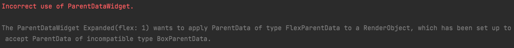
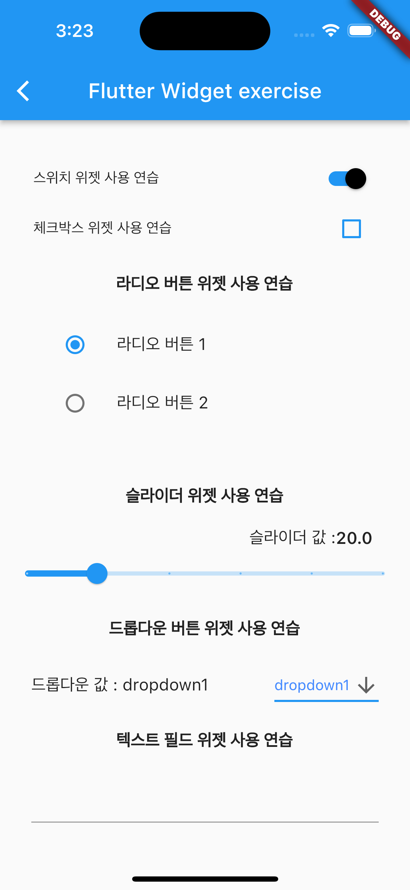

# flutter 2주차 스터디

## Trouble Shooting 정리
1. Incorrect use of ParentDataWidget.

- Trouble 발생 원인 : Expanded의 경우, Column, Row나 flex 위젯 내에서만 이용이 가능하다.

## 실행화면

## 참고 자료
- https://stackoverflow.com/questions/54905388/incorrect-use-of-parent-data-widget-expanded-widgets-must-be-placed-inside-flex