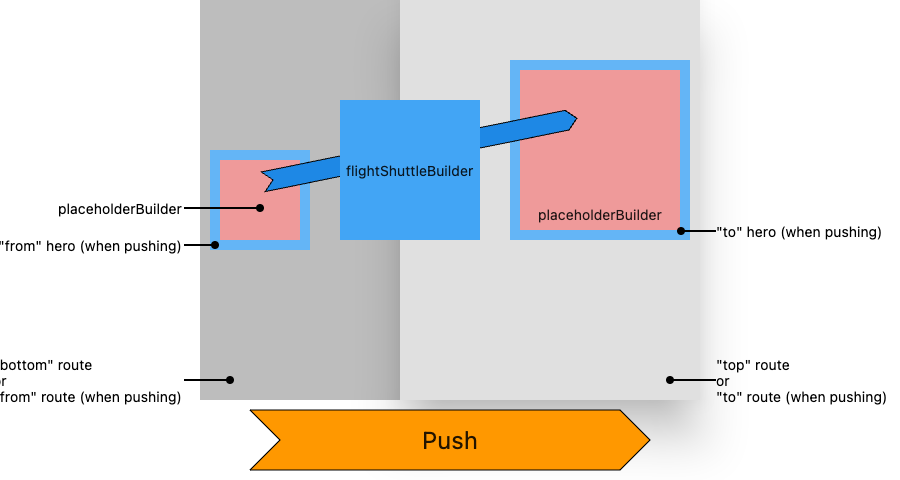

# Flutter 3주차 스터디
## 1. Navigation & Routing
### 1) Navigator
Stack을 이용하여 하위 위젯(화면) 집합을 관리하는 위젯이다. 가장 최근에 방문한 페이지가 이전 페이지 위에 시각적으로 중첩되어 논리 기록을 표시하기 위해 위젯 계층 맨 위에 navigator가 있어 이전 페이지로의 이동을 시각적으로 볼 수 있다.
- Navigator.push() : Route를 Navigator에 의해 관리되는 route 스택에 추가
- Navigator.pop() : Navigator에 의해 관리되는 route 스택에서 현재 Route를 제거
\* 첫 페이지를 제외하고는 appBar의 뒤로가기 버튼이 자동적으로 생성되고 pop이 들어가거나 appBar를 만들지 않게 되면 뒤로가기 버튼이 생성되지 않는다.
- Navigator.pushNamedAndRemoveUntil(context, '/', (_) => false) : 지금까지의 route에 쌓인 모든 페이지를 삭제하고자 할 때 사용
``` dart
onPressed: () {
  Navigator.of(context).push(
    MaterialPageRoute(
      builder: (context) => const LoginScreen(),
    ),
  );
},
```

### 2) Routing
MaterialApp 생성자에 initialRoute와 routes 이름의 추가 프로퍼티를 제공하여 route를 정의한다.
- initialRoute : 앱의 시작점을 나타내는 route 정의
\* initialRoute를 사용할 경우, home 프로퍼티를 정의하면 안된다.
- routes 프로퍼티 : 이용가능한 named route와 해당 route로 이동했을 때 빌드될 위젯을 정의
``` dart
MaterialApp(
  initialRoute: '/',
  routes: {
    '/': (context) => FirstScreen(),
    '/login': (context) => LoginScreen(),
  },
);
```
### 3) arguments 전달
1. 전달해야 하는 인수를 정의한다.
``` dart
class ScreenArguments {
  final String id;
  final String message;

  ScreenArguments(this.id, this.AuthToken);
}
```
2. 인수를 추출하는 위젯을 만든다.
- ModalRoute.of() : 인수와 함께 경로를 전달하는 메서드
``` dart
class ExtractArgumentsScreen extends StatelessWidget {
  static const routeName = '/extractArguments';

  @override
  Widget build(BuildContext context) {
    final ScreenArguments args = ModalRoute.of(context).settings.arguments;

    return Scaffold(
      appBar: AppBar(
        title: Text("Welcome, ${args.id}!"),
      ),
      body: Center(
        child: Text(args.message),
      ),
    );
  }
}
```
3. routes 테이블에 위젯을 등록한다.
``` dart
MaterialApp(
  routes: {
    ExtractArgumentsScreen.routeName: (context) => ExtractArgumentsScreen(),
  },     
);
```
4. 위젯으로 이동한다.
```
RaisedButton(
  child: Text("Navigate to screen that extracts arguments"),
  onPressed: () {
    Navigator.pushNamed(
      context,
      ExtractArgumentsScreen.routeName,
      arguments: ScreenArguments(
        'whaeundo25',
        'Hello! Nice to meet you!',
      ),
    );
  },
);
```

## 2. Advanced UI
### 1) Gesture
1. InkWell
제스쳐 기능을 제공하지 않는 위젯, 컨테이너를 InkWell 위젯으로 감싸면 onTap() 등의 기능을 제공해 주며 잉크가 번지는 듯한 애니메이션 효과를 준다.
``` dart
InkWell(
    onTap: () {
        print("click!");
    },
    child: Container(
        padding: EdgeInsets.all(15),
        child: Text("InkWell", style: TextStyle(fontSize: 16)),
    ),
)
```

2. GestureDetector
InkWell과는 다르게 사용자의 동작을 감지할 때 애니메이션 효과는 없지만 InkWell보다 다양하고 정밀한 Gesture들을 지원해 준다.
- onTap() : 탭하는 동작
- onLongPress() : 길게 누르는 동작
- onDoubleTap() : 두 번 탭하는 동작
- onScaleUpdate() : 두 손가락으로 화면을 확대 및 축소하는 동작
- onHorizontalDragUpdate() : 수평으로 드래그하는 동작
``` dart
GestureDetector(
    onTap: () {
        setState(() {
            _lightIsOn = !_lightIsOn;
        });
    },
    child: Container(
        color: Colors.yellow.shade600,
        padding: const EdgeInsets.all(8),
        child: Text(_lightIsOn ? 'TURN LIGHT OFF' : 'TURN LIGHT ON'),
    ),
),
```

### 2) Slivers
1. SliverAppBar 
- pinned : 초기 값은 false이며 스크롤을 내렸을 때 앱바를 사라지게 할 것인지, 사라지게 안 할 것인지 설정
- floating :  초기 값은 false로 스크롤을 내린 후 올렸을 때 AppBar가 천천히 나오게 할 것인지, 맨 위에서 나오게 할 것인지를 설정
- snap : 초기값은 false로 floating과 함께 작성해야 함. 스크롤을 내린 후 올렸을 때 AppBar가 한 번에 내려오게 됨
- expandedHeight : appBar가 expandedHeight로 설정된 크기만큼 확장되고 스크롤 내릴 경우 크기가 줄어듦
- flexibleSpace : appBar에 어떤 UI를 구현할 건지 설정

2. Sliver Widget
- SliverFillRemaining
스크롤 영역에 표시될 화면을 정의
- SliverGrid
gridDelegate를 통해 Grid view를 어떻게 나열할 것인지 설정
- SliverFixedExtentList
itemExtent를 통해 List의 크기를 정하고 delegate를 통해 화면에 표시될 위젯 설정

## 3. Animations
### 1) Implicit animations
위젯 내부에서 자체적으로 애니메이션이 일어나는 것을 이야기하며 이미 프로그래밍 되어 있거나, 스타일이 입혀져 있는 경우 암시적 애니메이션이라 한다.
\* 명시적 애니메이션 : 암묵적 애니메이션에서는 제공하지 않는, 애니메이션 커스터마이징을 할 수 있으며 반드시 애니메이션의 트리거를 지정해줘야 한다.

**\[여러가지 암시적 애니메이션 위젯\]**
- AnimatedAlign(Align) : 지정된 Align이 변경될 때마다 지정된 기한동안 자동으로 child의 위치를 전환하는 애니메이션 버전의 Align
- AnimatedContainer(Container) : 일정 기간 동안 점차적으로 값을 변경하는 Container 애니메이션
- AnimatedDefaultTextStyle(DefaultTextStyle) : TextSytle이 바뀔 때마다 자동적으로 애니메이션 진행
- AnimatedOpacity(Opacity) : 지정된 투명도가 변경될 때마다 지정된 기한동안 child의 투명도를 자동으로 애니메이션 진행
- AnimatedPadding(Padding) : 패딩이 변경되면 자동적으로 애니메이션 진행
- AnimatedPhysicalModel(PhysicalModel) : borderRadius와 elevation이 변경될 때마다 자동으로 애니메이션 진행
- AnimatedPositioned(Positioned) : Stack위젯에서 child의 위치를 제어하며
지정된 위치가 변경될 때마다 지정된 기간동안 child의 위치를 ​​자동으로 애니메이션
- AnimatedThemeSize : 지정된 Theme이 변경될 때마다 지정된 기한동안 색상 등을 자동으로 전환
- AnimatedSize : 주어진 child의 크기가 변할 때마다 주어진 기간 동안 자동으로 크기를 전환
- AnimatedCrossFade : 두 자식 사이에서만 페이드 되지만 크기를 보강하며 뒤집는 애니메이션
- AnimatedSwitcher : 새 위젯과, AnimatedSwitcher에서 자식으로 설정 한 위젯 간에 크로스 페이드를 수행

### 2) Hero animations
두 경로에 공통된 시각적 기능이 있는 경우 경로가 전환되는 동안 기능이 한 페이지에서 다른 페이지로 물리적으로 이동하도록 사용자를 안내하는데 도움을 주는 애니메이션



### 3) Staggered animations
일련의 작업을 통해 시각적 변화를 주어 애니메이션 효과를 주는 방법

**\[특이사항\]**
- 모든 애니메이션은 동일한 AnimationController에 의해 구동
- 애니메이션이 실시간으로 지속되는 시간에 관계없이 컨트롤러의 값은 0.0에서 1.0 사이
- 각 애니메이션의 값은 Interval 0.0에서 1.0 사이
- 일정 간격으로 애니메이션을 적용하는 각 속성에 대해 Tween을 생성하고 이는 해당 속성의 시작 및 끝 값을 지정
- Tween은 컨트롤러에서 관리하는 Animation 객체 생성

## 4. 참고 자료
- https://api.flutter.dev/flutter/widgets/GestureDetector-class.html
- https://docs.flutter.dev/development/ui/navigation
- https://api.flutter.dev/flutter/widgets/ImplicitlyAnimatedWidget-class.html
- https://api.flutter.dev/flutter/widgets/Hero-class.html
